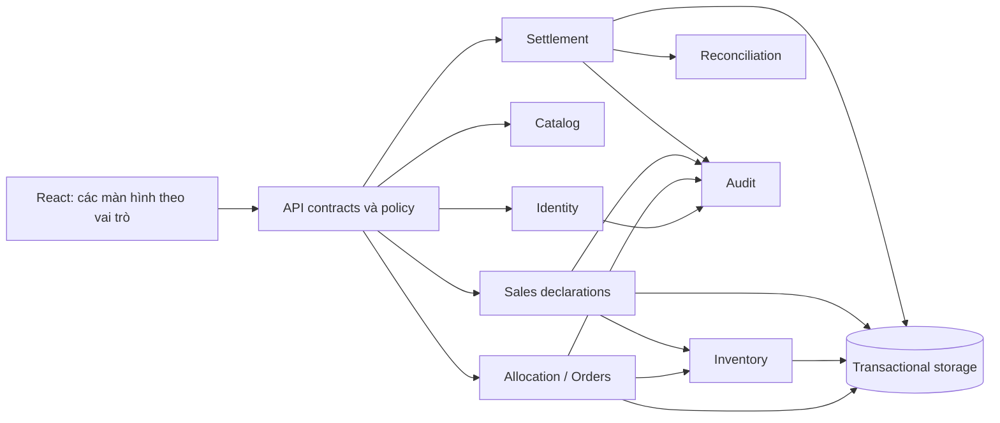

# Định hướng redesign và các quyết định cần chốt

Trạng thái: đề xuất từ audit. Cập nhật nghiệp vụ ngày 2026-10-09: nhiều lần đặt/nhận và nhiều báo cáo mỗi tuần, có gia hạn nộp; xem `acid-weekly-accounting-review.md` để biết contract phân kỳ và hàng hư/tặng. Các policy giá vốn/KPI còn cần chốt.
Giả định làm việc: bán hàng/cấp hàng qua cộng tác viên, tiền tệ VND,
timezone nghiệp vụ Asia/Ho_Chi_Minh. Nếu chọn bán trực tiếp hoặc kết hợp,
bổ sung customer/cart/payment/returns; không đổi nghĩa allocation cũ thành
customer purchase một cách ngầm định.

## Mục tiêu và người sử dụng

Cộng tác viên: yêu cầu cấp hàng, xác nhận nhận hàng, khai báo bán/hư/hoàn,
xem tồn thực và công nợ. Vận hành: duyệt yêu cầu, giao/thu hồi hàng, kiểm kê.
Tài chính: xác nhận khoản nộp, đối soát giao dịch với công nợ. Quản trị:
cấp quyền, khóa tài khoản, xem lịch sử hành động và hỗ trợ có truy vết.

Kết quả cần đạt: không mất/nhân đôi tồn khi lỗi hoặc retry; không sửa được dữ
liệu người khác ngoài quyền; doanh thu và tồn có nguồn kiểm chứng; tiền đã nộp
được tách khỏi doanh số; UI giải thích rõ trạng thái và hành động tiếp theo.
Chưa có dữ liệu workload/SLO; phải đo users đồng thời, số SKU, đơn/ngày,
retention và hạ tầng thực trước đặt mục tiêu hiệu năng.

## Kiến trúc đích

Dùng modular monolith: một backend deploy được độc lập, module có ownership
rõ. Trong mỗi module: HTTP adapter → application/use case → domain policy →
repository port → storage adapter. Domain không phụ thuộc Express/Mongoose,
React hoặc nhà cung cấp thanh toán. Giao dịch hàng/đơn trong cùng transaction.

Task/Kanban là module hỗ trợ riêng, không nằm trong transaction bán hàng.
Reporting là dữ liệu đọc dẫn xuất từ giao dịch đã được chấp nhận, không làm
nguồn sự thật cho kho. Chưa cần microservices, broker hay cache trước khi có
workload chứng minh nhu cầu. Đây là đề xuất thiết kế cho bối cảnh hiện tại.

## Domain và nguồn dữ liệu có thẩm quyền

| Domain | Dữ liệu sở hữu | Quy tắc cốt lõi |
| --- | --- | --- |
| Identity | Account, roles, permissions, session, invitation | Fail closed; role + ownership; tài khoản khóa/credential đổi làm mất hiệu lực phiên theo policy |
| Catalog | Product/SKU, price version, active/archive | SKU ổn định; đơn giữ snapshot; archive không làm mất lịch sử |
| Inventory | Location, balance, reservation, movement | Available = onHand - reserved; không âm; mỗi movement có reference duy nhất và reason |
| Allocation | Request, line, approval, shipment, receipt | Approval không đồng nghĩa received; status chỉ chuyển qua command hợp lệ |
| Sales | Declaration, line, acceptance/revision | Tổng server tính; quantity hợp lệ; giá theo policy được chốt, không lấy product hiện tại tùy tiện |
| Settlement | Receivable, payment, bank transaction, matching | Tiền nộp khác doanh số; external reference chống nhập trùng; hỗ trợ partial settlement |
| Audit | Actor, effective user, action, before/after, timestamp, reason, request ID | Truy được người hành động khi impersonate; không ghi mật khẩu/token |

Tiền VND là integer đồng trong giới hạn safe integer, kiểm tra overflow ở phép
nhân/tổng; nếu hỗ trợ tiền tệ khác dùng decimal/minor units với currency rõ.
Tách createdAt bất biến, effectiveAt nghiệp vụ, approvedAt, receivedAt.
Chu kỳ tuần do server chuẩn hóa theo timezone nghiệp vụ, lưu period ID và
khoảng thời gian; browser chỉ hiển thị/nhập ngày.

## Luồng cấp hàng đề xuất

1. Request: validate dòng, số lượng nguyên dương, SKU active, giá snapshot;
   normalize dòng trùng; command có idempotency key gắn actor + payload hash.
2. Reserve: kiểm tra và giữ hàng atomic trong cùng transaction với request.
   Nếu dòng bất kỳ fail, rollback toàn bộ; xử lý write conflict bằng retry có giới hạn.
3. Approve: ghi actor/time, không tự đánh dấu nhận hàng.
4. Dispatch/receive: chuyển hàng từ kho trung tâm qua in-transit tới vị trí
   cộng tác viên; nhận thực tế theo dòng. Có thể bắt đầu full receipt nếu nghiệp
   vụ chưa cần partial, nhưng schema không dùng boolean thay toàn bộ lịch sử.
5. Reject/cancel trước giao: giải phóng reservation đúng một lần. Sau giao,
   dùng return/correction có chứng cứ thay vì delete hoặc tự hoàn toàn bộ kho.
6. Sales/damage/return: chỉ tác động hàng đã nhận, update ledger khi được chấp
   nhận đúng một lần. Draft chưa là movement; revision sau chấp nhận có bút toán
   đảo/điều chỉnh rõ ràng. Report đọc từ giao dịch này.
7. Payment/settlement: ghi tiền nộp, đối chiếu với bank transaction và nghĩa vụ
   phải nộp; không tự coi totalRevenue là cash received.

Trạng thái đề xuất: REQUESTED → APPROVED → DISPATCHED → RECEIVED;
REQUESTED → REJECTED/CANCELLED; APPROVED → CANCELLED nếu chưa dispatch.
Returns là chứng từ riêng; thêm partial states chỉ khi cần. Cần chủ dự án xác
nhận thời điểm reserve/expire vì hiện code reserve lúc đặt nhưng chưa có expiry.

## Contract và frontend

- API v1, DTO id string thống nhất; ObjectId/populated document không thoát
  storage adapter. Schema request/response và mã lỗi dùng chung qua OpenAPI.
- List có limit/cursor, filter và sort server-side; màn dashboard có API
  aggregates. Commands trả state/version mới; optimistic locking tránh ghi đè.
- Không nhận totalRevenue/remainingStock như dữ liệu đáng tin từ client.
- App shell chỉ giữ session/layout. Server state theo feature với TanStack Query;
  cart/form local state, filter ở URL. Không dùng hai hệ thống global state cho
  cùng dữ liệu. Loading/error/empty/retry và pending mutation riêng từng khu vực.
- Route lazy loading; feature folders chứa API hooks, schema, pages/components.
  Error boundary và unauthorized route riêng; mọi quyền vẫn được enforce tại API.
- TS strict + tsc noEmit, ESLint TS/TSX; bỏ any theo API contracts. Sửa entry
  extension, loại mock/dead code sau khi có kiểm chứng hành vi cần giữ.
- UI ưu tiên dashboard theo vai trò; phân biệt yêu cầu cấp hàng, giao hàng,
  nhận hàng, khai báo bán và đối soát. Hiển thị VND/ngày giờ nhất quán; lỗi chỉ
  rõ hành động khắc phục, không tự cắt số lượng input mà không thông báo.

## Lựa chọn công nghệ

Có thể giữ React 19/Vite/Tailwind hiện có. Backend-standard cá nhân ưu tiên
FastAPI/Pydantic/DI; audit không cho thấy đổi framework tự khắc phục sai domain.
Hai hướng cần quyết định trước implementation: refactor Express theo module
để giảm rủi ro chuyển đổi, hoặc backend mới FastAPI khi đội ngũ muốn chuẩn hóa
Python và đủ nguồn lực chuyển contract. Đề xuất chuyển từng lát cắt qua contract,
tránh thay toàn bộ backend/frontend/database cùng một lần.

MongoDB có thể tiếp tục nếu topology hỗ trợ multi-document transaction và
đã có chiến lược indexes/constraints/backup. PostgreSQL là phương án cân nhắc
cho ledger/đối soát nhiều quan hệ, không là quyết định đã chốt. Nếu giữ Mongo,
kiểm chứng rollback, concurrent reservation và retries trên replica set thật.
Schema/index changes dùng migration rõ ràng. Người dùng đã xác nhận bỏ gate của skill cũ; index local đã được áp dụng, xem runbook.

## Thứ tự thực hiện và tiêu chí hoàn thành

| Giai đoạn | Deliverables | Gate bắt buộc |
| --- | --- | --- |
| 0. Chốt nghiệp vụ | Mô hình bán, quyền, inventory/payment policy, workload, flow map | Use cases + acceptance criteria được chốt; kiểm kê dữ liệu nguồn |
| 1. Chặn lỗi nghiêm trọng | Config validation, auth policy, input contracts, session/invitation fixes | Regression cho A01-A06/A10, deny-by-default API tests; boot/readiness với DB test |
| 2. Transactional core | Reservation, allocation commands, movement ledger, idempotency | Multi-line fail rollback; tranh chấp stock; retry không nhân đơn; reject/cancel release một lần |
| 3. Sales và settlement | Server-derived totals, revisions, receipt periods, payment matching | Tồn khớp movement; doanh số khớp accepted lines; nhập bank trùng không nhân tiền; partial payments đúng |
| 4. Frontend redesign | Navigation theo role, feature state, typed API, forms, lazy routes | Browser E2E admin/distributor; loading/error/retry; responsive/keyboard; tsc/lint/build |
| 5. Migration và release | Mapping dữ liệu, dry run, comparison report, rollback, runbook | Backup/restore thử; staging E2E với dữ liệu đã ẩn thông tin; reconcile trước cutover |

Các regression ưu tiên: quantity 0/âm/lẻ/overflow, items rỗng/trùng;
đặt song song khi stock=1 chỉ một yêu cầu thành công; lỗi dòng 2 không đổi dòng 1;
repeat command trả cùng kết quả; payload khác cùng idempotency key bị conflict;
owner khác nhận 403/404 không ghi dữ liệu; trạng thái sai nhận 409;
report approved chưa received không tăng hàng khả dụng; thay giá không đổi lịch sử;
thu hồi quyền/password reset chặn phiên theo policy; impersonation giữ actor gốc.

## Chuyển đổi dữ liệu và vận hành

Chỉ khảo sát dữ liệu qua read-only trước: duplicate reports, negative stocks,
orders đã reject/receive, orphan references, Statement1 collection, mutable dates,
currency và lịch sử giá. Kho hiện tại đã bị decrement bởi pending order; không
thể lấy trực tiếp stock làm physical onHand rồi reserve lần nữa.

Cần số dư đầu được kiểm kê/chốt, mapping IDs, các ngoại lệ không đủ lịch sử
đưa vào danh sách reconciliation; không suy diễn ledger chính xác từ dữ liệu
thiếu và tự sửa số tiền. Sau dry-run, migrate theo batch có checkpoint,
chống chạy trùng, so sánh balances/counts/totals; cutover ngắn có khóa ghi hoặc
cơ chế đồng bộ rõ. Rollback phải xử lý cả dữ liệu phát sinh sau cutover.

Startup fail khi config sai; readiness phụ thuộc DB; request ID, structured
logs, metrics error/latency/conflict, alert mismatch kho/tiền; graceful shutdown,
backup/restore runbook và deployment config theo environment.

## Những câu hỏi chưa được chốt

1. Chỉ bán qua cộng tác viên, bán trực tiếp, hay cả hai? Đây là quyết định ảnh
   hưởng scope customer checkout/payment/refund.
2. Đơn là mua đứt, cấp hàng ký gửi hay yêu cầu điều chuyển? Khi nào reserve,
   dispatch, receive; có giao một phần và hạn giữ hàng không?
3. Đã xác nhận cho phép nhiều báo cáo cùng tuần. Cộng tác viên bán theo giá nào; có chiết
   khấu/hoa hồng, hàng hư/hoàn được ai chấp nhận; tuần được khóa khi nào?
4. Vai trò kho/tài chính/duyệt có tách? Quyền impersonate và chỉnh lịch sử?
5. Hệ thống đang có dữ liệu thật/bao nhiêu người dùng; host/DB topology,
   thời gian downtime chấp nhận; giữ stack hay chuẩn hóa backend Python?

Chưa đủ căn cứ để freeze kiến trúc chi tiết hoặc bắt đầu rewrite toàn bộ.
Bước triển khai đầu tiên sau khi chốt scope là acceptance contracts và xử lý P0.
